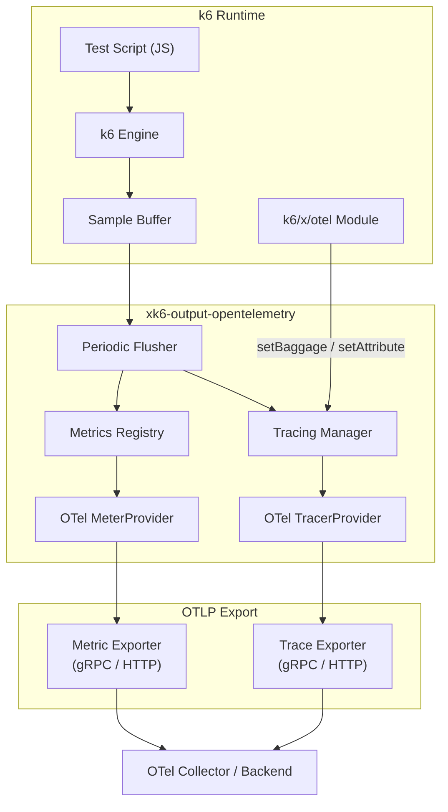
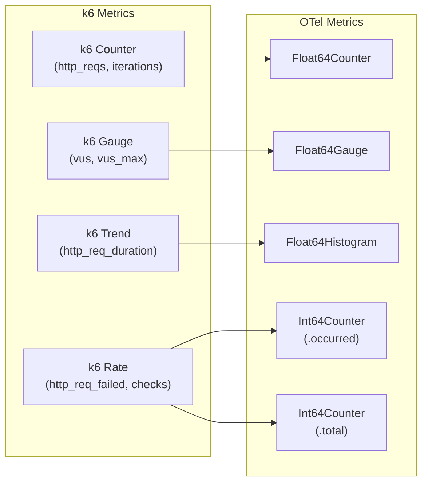
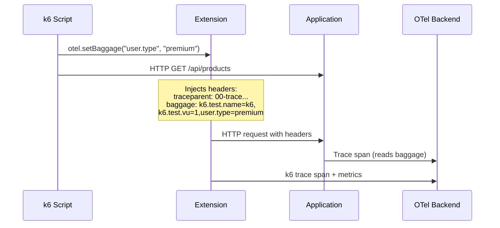

# Architecture

## Data Flow



## Trace Structure

```mermaid
gantt
    title k6 Trace Structure (single iteration)
    dateFormat X
    axisFormat %s

    section Lifecycle
    k6.iteration               :0, 100

    section HTTP Requests
    HTTP GET /api/products     :5, 20
    HTTP GET /api/product/ABC  :25, 40
    HTTP POST /api/cart/add    :45, 60
    HTTP POST /api/checkout    :65, 95

    section Checks
    check: status is 200       :21, 23
    check: has items           :41, 43
```

## Metrics Pipeline



## Baggage Flow



## Decisions

### ADR-001: Output type registered as `otel-extended`

**Status:** Accepted (2026-05-20)

**Context.** k6 v1.0.0 promoted its experimental OpenTelemetry output to a built-in and registered it under the type name `opentelemetry`. This extension predates that change and originally registered itself under the same name. From k6 v1.x onward, `xk6 build` refuses to load the extension with `invalid output extension opentelemetry, built-in output with the same type already exists`, so any binary built against current k6 fails before a test can run.

**Decision.** Register this extension as `otel-extended`. Users invoke it as `--out otel-extended`.

**Rationale.** The built-in handles metrics only; this extension also exports traces and injects W3C Baggage. The `-extended` suffix signals that differentiator and avoids collision with the built-in. Pinning k6 to a pre-v1.0 version was rejected because it would lose ongoing k6 fixes and capabilities. Dropping the extension in favor of the built-in was rejected because it would regress the traces and baggage features that motivate this project.

**Consequences.** Users upgrading from a pre-rename build must update their k6 invocation (`--out opentelemetry` → `--out otel-extended`); the built-in `opentelemetry` output remains available to them but does not emit traces or baggage. CI/CD pipelines and Docker examples that hardcode the old name must be updated.
