# OpenTelemetry Demo Light

A real-world example using the extension with [opentelemetry-demo-light](https://github.com/henrikrexed/opentelemetry-demo-light) — a lightweight microservices demo with 5 services in 5 languages.

## The Script

This k6 script simulates realistic user journeys: browsing products, viewing details, adding to cart, and checking out. Every request carries W3C TraceContext and Baggage headers, creating connected distributed traces from the load generator through all backend services.

```javascript
import { sleep } from "k6";
import otel from "k6/x/otel";
import { randomItem, randomIntBetween } from "https://jslib.k6.io/k6-utils/1.4.0/index.js";

const PRODUCT_IDS = [
  "OLJCESPC7Z", "66VCHSJNUP", "1YMWWN1N4O", "L9ECAV7KIM", "2ZYFJ3GM2N",
  "0PUK6V6EV0", "LS4PSXUNUM", "9SIQT8TOJO", "6E92ZMYYFZ", "HQTGWGPNH4",
];

const BASE_URL = __ENV.FRONTEND_URL || "http://frontend:8080";

export const options = {
  scenarios: {
    continuous: {
      executor: "constant-vus",
      vus: 5,
      duration: "5m",
    },
  },
  thresholds: {
    http_req_duration: ["p(95)<5000"],
    http_req_failed: ["rate<0.1"],
  },
};

export default function () {
  // Scenario-level baggage — visible to all downstream services
  otel.setBaggage("test.scenario", "browse-and-buy");
  otel.setAttribute("test.type", "load");

  // --- Browse Products ---
  otel.step("Browse Products", function () {
    const products = otel.request("list-products", "GET", \`\${BASE_URL}/api/products\`);
    otel.check("products-loaded", products, {
      "status is 200": (r) => r.status === 200,
    });
  });
  sleep(randomIntBetween(1, 3));

  // --- View Product Detail ---
  const productId = randomItem(PRODUCT_IDS);
  otel.step("View Product", function () {
    otel.setBaggage("product.id", productId);
    const product = otel.request("get-product", "GET", \`\${BASE_URL}/api/product/\${productId}\`);
    otel.check("product-found", product, {
      "status is 200": (r) => r.status === 200,
    });
  });
  sleep(randomIntBetween(1, 2));

  // --- Add to Cart ---
  otel.step("Add to Cart", function () {
    otel.setBaggage("cart.action", "add");
    otel.setAttribute("business.flow", "cart");
    otel.request("add-to-cart", "POST", \`\${BASE_URL}/api/cart/add\`,
      JSON.stringify({ productId: productId, quantity: randomIntBetween(1, 3) }),
      { headers: { "Content-Type": "application/json" } }
    );
  });
  sleep(randomIntBetween(1, 2));

  // --- Checkout (33% of iterations) ---
  if (Math.random() < 0.33) {
    otel.step("Checkout", function () {
      otel.setAttribute("business.flow", "purchase");
      otel.setBaggage("checkout.initiated", "true");
      const order = otel.request("place-order", "POST", \`\${BASE_URL}/api/checkout\`,
        JSON.stringify({
          email: "test@example.com",
          creditCardNumber: "4111111111111111",
          creditCardCvv: "123",
          creditCardExpirationYear: "2030",
          creditCardExpirationMonth: "12",
        }),
        { headers: { "Content-Type": "application/json" } }
      );
      otel.check("order-placed", order, {
        "status is 200": (r) => r.status === 200,
      });
    });
  }

  sleep(randomIntBetween(1, 3));
}
```

## What You Get

### Traces
Every k6 iteration creates a parent span with child spans per step:

```mermaid
gantt
    title k6 Iteration Trace
    dateFormat X
    axisFormat %s

    section Load Generator
    iteration           :0, 10
    Browse Products     :0, 2
    View Product        :3, 5
    Add to Cart         :6, 7
    Checkout            :8, 10

    section Frontend
    GET /api/products   :0, 1
    GET /api/product/X  :3, 4
    POST /api/cart/add  :6, 7
    POST /api/checkout  :8, 10

    section Backend
    Product Catalog     :0, 1
    Product Catalog     :3, 4
    Cart + Valkey       :6, 7
    Checkout → Payment  :8, 10
```



### Baggage Propagation
Downstream services see baggage like:
```
k6.test.name=k6, k6.test.step=Browse Products, test.scenario=browse-and-buy, product.id=OLJCESPC7Z
```

The Product Catalog service (Go) reads this baggage and attaches it as span attributes.

## Run It

```bash
# Start the demo
cd opentelemetry-demo-light
docker compose --profile jaeger up -d

# Traces visible at http://localhost:16686
```
