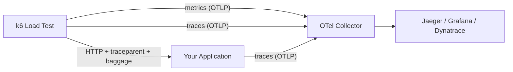

# xk6-output-opentelemetry

A k6 output extension that exports **metrics, traces, and W3C Baggage** to any OTLP-compatible backend.



## Key Features

| Feature | Description |
|---------|-------------|
| **Metrics** | All k6 built-in metrics as OTel counters, gauges, histograms |
| **Traces** | Per-iteration, per-request, per-check spans with full attributes |
| **W3C Baggage** | Injects `k6.test.*` metadata on outgoing HTTP requests |
| **JS API** | `import otel from "k6/x/otel"` for custom baggage and attributes |
| **Dual protocol** | gRPC and HTTP OTLP export |

## Quick Start

```bash
# Build k6 with the extension
xk6 build v1.6.1 --with github.com/henrikrexed/henrikrexed-xk6-output-opentelemetry

# Run with OTel output
K6_OTEL_GRPC_EXPORTER_INSECURE=true \
K6_OTEL_EXPORTER_OTLP_ENDPOINT=localhost:4317 \
./k6 run --out opentelemetry test.js
```
